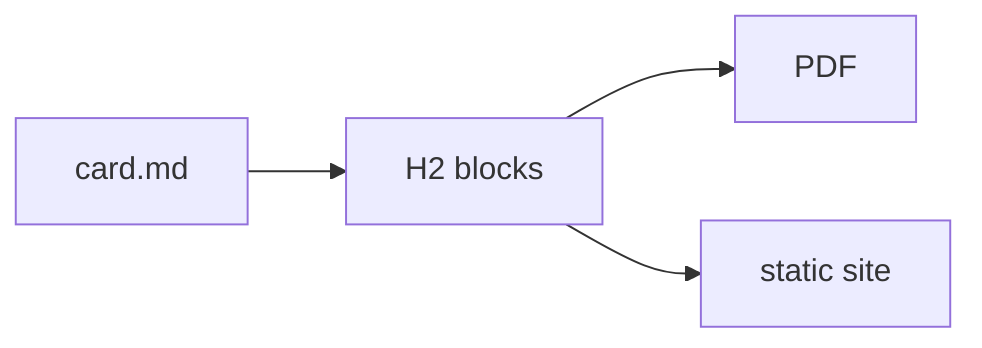

# Card Structure

A card is a `.md` file. YAML frontmatter between `---` delimiters carries metadata.
The first H1 becomes the card title, unless the frontmatter declares a `title:` — then
nothing is consumed and every heading renders. Every H2 heading starts a new block, and
the heading text is slugified to produce a CSS class on that block's `<section>` element.
A *further* H1 is a block too, one rank above the H2s beneath it — which is how a long
card numbers its top-level steps with `#`.

This card uses all five conventional block types — the rendered output IS the demo.

## What Changed

Each H2 creates a block. The heading text is lowercased and non-alphanumeric characters
are replaced with hyphens: `## What Changed` → CSS class `what-changed`.

Explicit classes and ids override the auto-slug via Pandoc attribute syntax:

```markdown
## Watch Out {.watch-out #wo-overview}
```

Multiple classes are space-separated inside the braces. The explicit `id` becomes the
HTML `id` attribute and the PDF named-destination anchor for that block.

## How to Fix

The conventional block headings and their CSS classes:

| Heading text | CSS class | Conventional use |
|---|---|---|
| (text before first H2) | `intro` | Lead paragraph / overview |
| `## What Changed` | `what-changed` | API or behaviour delta |
| `## How to Fix` | `how-to-fix` | Remediation steps |
| `## Watch Out` | `watch-out` | Pitfalls and gotchas |
| `## Check` | `check` | Verification steps |

Themes style each class distinctly. You are not limited to these names — any heading
level from H2 through H6 produces a block with an auto-slugged class you can target in
your own CSS.

## Nested blocks

H3 (and deeper, down to H6) also create blocks — nested inside whichever shallower
block was open when they appeared, not flattened into it. A heading at level *L* closes
every currently-open block at level *L* or deeper, then opens a new one nested under
whichever block (if any) is still open above it: the same rank-based rule Pandoc's
`--section-divs` and Docutils' section transform use.

```markdown
## Setup

Runs before every H3 below it.

### Prerequisites

Nested inside "Setup", not a sibling of it.

## Usage
```

`## Setup` and `## Usage` are top-level blocks; `### Prerequisites` is a child block
*inside* `## Setup`'s block, rendered as its own nested `<section>` — independently
targetable in CSS via its own auto-slugged class (`prerequisites`) or an explicit
`{.class #id}` attribute, exactly like a top-level block. A card that never goes deeper
than H2 renders identically to before nesting existed — nesting is purely additive.

Skipping a level (an H4 directly under an H2, no H3 in between) still nests correctly:
the H4 attaches to the nearest still-open shallower block, here the H2.

## Watch Out

Do not place an H2 (or any block-level heading) before the H1. The parser treats H1 as
the card title and every H2–H6 as a block boundary. A heading before the H1 produces a
block with no title above it, which renders oddly in most themes.

`verify: false` in frontmatter suppresses `check`-classed blocks at every nesting depth,
not just the top level — a `### Check {.check}` nested three levels deep is suppressed
exactly like a top-level `## Check`.

Wide fenced code blocks get clipped at the page edge in print/PDF targets — there's no
scrollbar to fall back on there the way there is on the web. Rather than picking a font
size, drop a specific block a step with the same attribute-list syntax used above,
placed on its own line right after the closing fence:

````markdown
```java
some wide line of code that would otherwise run off the page...
```
{.fs--1}
````

The attribute line has to sit immediately after the closing fence with a blank line (or
end of file) after it — glue it directly to the next paragraph with no blank line and it
attaches to *that* paragraph instead of the code block. `fs--1` shaves roughly 10% off
the rendered code size, `fs--2` about 20%; going further than `fs--2` hurts legibility in
print.

Attributes can also ride the opening fence's info line, which keeps the tag with the
block it describes instead of dangling after it:

````markdown
```text {.output}
[INFO] tool output here
```
````

Both spellings do the same thing, and the language survives for syntax highlighting.
The trailing form stays useful when an attribute is an afterthought, like a size
step-down on an already-written block.

For the three recurring editorial roles there's a shorthand: the fence language
*is* the block type, no attribute syntax at all —

````markdown
```command
mvn dependency:tree
```

```output
[INFO] com.example:app:jar:1.0.0
```

```console
$ ls target
book.pdf
```
````

`command` renders highlighted as bash with a "Command" label — the reader types this.
`output` is unhighlighted with an "Output" label — a tool produced this. `console` is a
mixed session ($-prefixed commands with their output), highlighted as `shell-session`.
Every theme gets a neutral treatment for all three; themes may restyle them. Real
languages (` ```java `, ` ```xml `) pass through untouched, and the attribute spellings
(` ```bash {.command} `) keep working for cases the shorthand doesn't cover.

On screen — the static site, or an `emitHtml` file in a browser — `command`, `console`
and ` ```bash ` blocks grow a **Copy** button in their corner (a console block copies just its
`$`-prefixed command lines, prefix stripped, since the output is for comparing, not
pasting). Give any other block the same affordance with a `{.copy}` info-line attribute,
take it off one block with `{.no-copy}`, or turn the feature off book-wide with
`vars.copyButtons: false`. Print output never shows the buttons.

### Mermaid diagrams

One more bundled type draws instead of printing: a ` ```mermaid ` fence holds a
[Mermaid](https://mermaid.js.org/) diagram as text, and the page renders it to an inline
SVG — on the static site and in the PDF alike (the build waits for every diagram to
finish rendering before it snapshots or measures a page, so printed page numbers stay
exact). This one is live, rendered from this card's own fence:



Mermaid's colour theme follows `vars.mermaidTheme` (`default`, `dark`, `forest`,
`neutral`, `base`) — set it book-wide when the page theme is dark. A diagram that doesn't
parse fails the PDF build carrying mermaid's own error; on the site the error shows in
the browser console and in place of the diagram. Like syntax highlighting, the library
loads from the CDN at render time, so a fully offline build machine needs network access
for books that use it — books without a ` ```mermaid ` fence never fetch it.

### Define your own block type

A fenced block does two things: it captures text verbatim, and it selects how that text
renders. The second half is a **block template** — put a Pebble fragment at
`layouts/blocks/<type>.html` and ` ```<type> ` renders through it:

````markdown
```filetree
src/
  main/
```
````

```html
<!-- layouts/blocks/filetree.html -->
<figure class="filetree"><pre><code>{{ content }}</code></pre></figure>
```

The fragment's model: `content` (the verbatim block text — `{{ content }}` is escaped,
`| raw` is a deliberate choice), `type`, `classes` and `id` (from info-line attributes),
and `vars`. Resolution walks the usual chain — theme templates, then the book's
`layouts/blocks/`, then the bundled ones — so a book can override `output`, and a theme
can restyle a block type structurally, not just with CSS. The built-in `command`,
`output`, `console` and `mermaid` are themselves bundled block templates on this mechanism. (The
guide's directory trees, like the one in Organising Content, are a `filetree` block —
see this book's own `layouts/blocks/`.)

Two things to hold on to: a template for a *real* language (`layouts/blocks/java.html`)
captures every ` ```java ` block in the book — powerful, and worth doing only on
purpose. And a broken template fails the build naming the card, the type, and the
template file.

### PlantUML diagrams

A template rearranges text. Drawing a diagram takes code, which paperband ships as an
optional module rather than a dependency every book carries: add
`dev.noregressions.paperband:block-plantuml` to the **plugin's** own `<dependencies>` and
` ```plantuml ` (also ` ```puml `, ` ```uml `) becomes a diagram.

````markdown
```plantuml
Alice -> Bob: order placed
Bob --> Alice: confirmed
```
````

`@startuml` / `@enduml` are optional — the fence already said it was a diagram — though any
other `@start` form (`@startmindmap`, `@startgantt`, `@startjson`, …) is passed through as
written. This guide has the module installed, so that fence is this drawing:

```plantuml
Alice -> Bob: order placed
Bob --> Alice: confirmed
```

Unlike mermaid, this one is drawn during the build, not by the browser: the SVG is in the
HTML before Chromium ever sees the page. So there is nothing to wait for, nothing to fetch,
the labels stay real selectable text in the PDF, and an offline CI machine renders it
happily. Settings come from the `vars` cascade, so they can be book-wide or per folder:

```yaml
vars:
  plantuml:
    theme: plain          # one of PlantUML's 40-odd bundled !theme names
    styleFile: styles/diagrams.puml   # your own styling — see below
    style: "<style>root { FontSize 11 }</style>"   # ...or inline, per folder or card
    background: "#fff"    # default transparent — the page shows through
    format: svg           # or png, embedded as a data: URI
    scale: 0.8
```

A diagram that doesn't parse fails the build with PlantUML's own message. PlantUML's own
habit is to *draw* the error instead, which in a book means a page that builds green and
prints a picture of a stack trace.

### Making diagrams match the book

**Not with CSS**, which is the first thing everyone tries. PlantUML bakes every colour into
the shape that carries it — `fill="#E2E2F0"`, `style="stroke:#181818"` — and emits no class
attributes at all, so a stylesheet has nothing to select. Neither the theme nor the book's
CSS chain can reach inside the drawing.

What can is PlantUML's own style language, and `styleFile` is where a book keeps it: one
file, named once in the root `paperband.yaml`, applied to every diagram in the book. This
guide's is `styles/diagrams.puml`, which is why the sequence diagram above is set in IBM
Plex on the page's own paper rather than in Arial on a white rectangle:

```
<style>
root {
  FontName        "IBM Plex Sans"
  FontColor       #333333
  LineColor       #aeb7c2
  BackgroundColor transparent
}
participant, class, node, component {
  BackgroundColor #f6f8fa
  LineColor       #aeb7c2
}
arrow { LineColor #687280; FontSize 11 }
</style>
```

The file is injected verbatim, so `skinparam` lines, `!include` and `!theme` all work in
there too — and the pieces compose broadest-first: a bundled `theme:`, then `styleFile:`,
then an inline `style:` from a folder or a single card, each overriding the last.

Two things to know. The colours are a hand-made copy of the theme's — the two systems have
no way to share tokens, so a palette change means editing both. And PlantUML measures text
with fonts installed *on the build machine* to decide how big each box is; a face that
isn't there is substituted for layout while the SVG still asks the browser for the real
one. The labels don't clip (PlantUML pins each one with `textLength`), but glyph spacing
can look faintly stretched. Naming a font the machine has avoids it.

`mvn paperband:blocks` lists every fence type the build can render and what renders each —
the first thing to run when a diagram came out as a code block. Writing your own renderer
is in [Extending Paperband](card:extending).

## Linking to another card

Write the card's id with a `card:` scheme, in an ordinary Markdown link:

```markdown
See [the Frontmatter Reference](card:frontmatter) for every field.
```

Paperband spells it for whichever output is being built:

| Written | In the PDF | On the site |
|---|---|---|
| `card:frontmatter` | `#card-frontmatter` | `cards/frontmatter.html`, from wherever the page sits |
| `card:frontmatter#watch-out` | `#card-frontmatter` | `cards/frontmatter.html#watch-out` |

A card's id is *both* a PDF destination and a site page — and prose can only name one of
them. `#card-frontmatter` is a dead anchor on the site, where each card is its own
document; `cards/frontmatter.html` is a dead file reference in the PDF, and is wrong from a
card page anyway, which sits a directory below the landing pages. The engine always knew the
right answer — it writes its own nav links. `card:` is how you ask for it.

It stays ordinary Markdown on purpose: an editor, a previewer and a link checker all see a
link, and there is no `` tag to eat the following newline.

### It is checked

A `card:` link naming a card that isn't in the book **fails the build**, in the same way an
over-budget card does:

```output
A card link points at nothing:
  card:frontmater in 01-card-structure.md — no card has that id. Did you mean 'frontmatter'?
```

That is the point of the form. The two hand-written spellings rot silently: rename an id and
every reference to it dies in one output or both, and nothing tells you until a reader
clicks. Anchors are checked too — `card:frontmatter#watchout` fails and suggests
`watch-out`.

A card that a `select:` or an edition left out gets its own message, because that is a
different mistake from a typo:

```output
  card:beta in alpha.md — card 'beta' is in the book but this build leaves it out, so the
  link would go nowhere here.
```

Building one card (`-Dpaperband.input=some/card.md`) doesn't check: a single-card render is
a preview of that card, and failing it for mentioning its neighbours would break the preview
exactly when you want it. The book build checks the same prose moments later.

### Why print ignores the anchor

Block anchors are slugged from the heading with no card prefix, so in one print document
eleven cards in this guide each emit `id="watch-out"`. A fragment link would land on
whichever came first — a wrong answer wearing a right answer's clothes. In the PDF a `card:`
link therefore stops at the card, which is unambiguous. On the site each card is its own
page, so the anchor is exact. The fragment is validated either way.

## Raw HTML and the content policy

Raw HTML in a card is a legitimate *structural* escape hatch — a table with rowspans,
`<kbd>Ctrl</kbd>`, a `<details>` block. What it is **not** is a styling channel: content
carries structure, and the theme owns appearance — that separation is what lets a reader
pick a theme and have it actually apply.

The build enforces this with a content policy, declared through the `vars` cascade
(book-wide in the root yaml, overridable per folder, or via the POM's `<vars>`):

```yaml
vars:
  contentPolicy: clean    # the default — allow | clean | strict
```

- **`clean`** (default) — presentation found in content is stripped and each removal is
  logged, naming the card and what went. Stripped: inline `style=`, `<style>` and
  `<script>` blocks, head-metadata elements (`<link>`, `<meta>`, `<title>`, `<base>`),
  presentational tags (`<font>`, `<center>` — unwrapped, their content kept) and
  attributes (`align`, `bgcolor`, `width`, `border`, …), and `on*` event handlers.
  Classes and ids survive — they're the sanctioned route — and so does `align` on
  table cells, because GFM's `---:` column syntax renders as exactly that: it's
  markdown-authored semantics, not smuggled styling.
- **`strict`** — the same findings fail the build instead, for teams that want the
  source fixed rather than laundered.
- **`allow`** — content HTML passes verbatim, today's escape hatch.

Fenced and inline code are never touched: a literal `<div style="…">` inside an example
is escaped text by the time the policy runs, so this page can show the syntax it strips.

To style content, name the *meaning* with a class and let CSS own the look:

```markdown
> Deletes the working directory. {.warning}
```

with a `.warning` rule in the book's `css:` chain, a theme, or the POM's
`<stylesheets>`. That's the styling that survives a theme switch — and the reason
`style="color: red"` doesn't.

## Check

```bash
mvn paperband:scan -Dpaperband.input=path/to/card.md
```

The scan output lists every block's heading, resolved CSS classes, and a snippet of its
rendered HTML. Use it to verify block boundaries before a full build.
