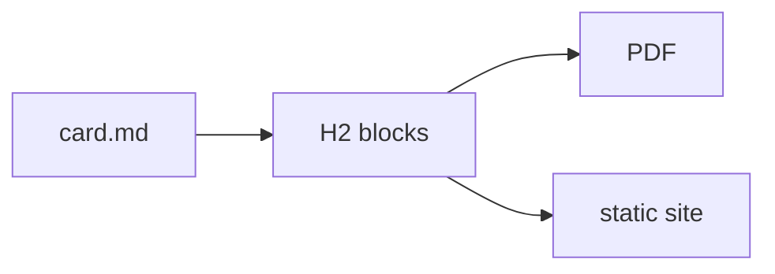

# Card Structure

A card is a `.md` file. YAML frontmatter between `---` delimiters carries metadata.
The first H1 becomes the card title, unless the frontmatter declares a `title:` — then
nothing is consumed and every heading renders. Every H2 heading starts a new block, and
the heading text is slugified to produce a CSS class on that block's `<section>` element.
A further H1 is also a block, one rank above the H2s beneath it; a long card can use this
for its top-level steps.

This card uses all five conventional block types.

## What Changed

Each H2 creates a block. The heading text is lowercased and non-alphanumeric characters
are replaced with hyphens: `## What Changed` → CSS class `what-changed`.

Explicit classes and ids override the auto-slug via Pandoc attribute syntax:

```markdown
## Watch Out {.watch-out #wo-overview}
```

Multiple classes are space-separated inside the braces. The explicit `id` becomes the
HTML `id` attribute and the PDF named-destination anchor for that block.

## How to Fix

The conventional block headings and their CSS classes:

| Heading text | CSS class | Conventional use |
|---|---|---|
| (text before first H2) | `intro` | Lead paragraph / overview |
| `## What Changed` | `what-changed` | API or behaviour delta |
| `## How to Fix` | `how-to-fix` | Remediation steps |
| `## Watch Out` | `watch-out` | Pitfalls and gotchas |
| `## Check` | `check` | Verification steps |

Themes style each class distinctly. Other names work too: any heading from H2 to H6
produces a block with an auto-slugged class that CSS can target.

## Nested blocks

H3 to H6 headings also create blocks, nested inside the shallower block that is open when
they appear. A heading at level *L* closes every open block at level *L* or deeper, then
opens a new block under the block still open above it, if any. This is the rank-based rule
used by Pandoc's `--section-divs` and Docutils' section transform.

```markdown
## Setup

Runs before every H3 below it.

### Prerequisites

Nested inside "Setup", not a sibling of it.

## Usage
```

`## Setup` and `## Usage` are top-level blocks; `### Prerequisites` is a child block inside
`## Setup`, rendered as its own nested `<section>`. It can be targeted in CSS by its
auto-slugged class (`prerequisites`) or an explicit `{.class #id}` attribute, like a
top-level block. A card with no heading deeper than H2 renders as a flat list of blocks.

Skipping a level (an H4 directly under an H2, no H3 in between) still nests correctly:
the H4 attaches to the nearest still-open shallower block, here the H2.

## Watch Out

Do not place an H2 (or any block-level heading) before the H1. The parser treats H1 as
the card title and every H2–H6 as a block boundary. A heading before the H1 produces a
block with no title above it.

`verify: false` in frontmatter suppresses `check`-classed blocks at every nesting depth:
a nested `### Check {.check}` is suppressed like a top-level `## Check`.

Wide fenced code blocks are clipped at the page edge in PDF output, which has no scrollbar.
To reduce one block's font size, add an attribute list on its own line directly after the
closing fence:

````markdown
```java
some wide line of code that would otherwise run off the page...
```
{.fs--1}
````

The attribute line must directly follow the closing fence and be followed by a blank line
or the end of the file. Without the blank line it attaches to the next paragraph instead.
`fs--1` reduces the code size by about 10%, `fs--2` by about 20%; smaller sizes are hard
to read in print.

Attributes can also go on the opening fence's info line:

````markdown
```text {.output}
[INFO] tool output here
```
````

Both forms are equivalent, and the language is kept for syntax highlighting. The trailing
form is convenient for adding an attribute to an existing block.

Three common block roles have a shorthand, where the fence language is the block type:

````markdown
```command
mvn dependency:tree
```

```output
[INFO] com.example:app:jar:1.0.0
```

```console
$ ls target
book.pdf
```
````

`command` is highlighted as bash with a "Command" label, for input the reader types.
`output` is unhighlighted with an "Output" label, for tool output. `console` is a mixed
session of `$`-prefixed commands and their output, highlighted as `shell-session`. All
three have a neutral default style that themes can override. Real languages (` ```java `,
` ```xml `) are unaffected, and the attribute forms (` ```bash {.command} `) still work.

On screen (the static site, or an `emitHtml` file in a browser), `command`, `console` and
` ```bash ` blocks get a **Copy** button. A console block copies only its `$`-prefixed
command lines, without the prefix. Add the button to another block with a `{.copy}`
info-line attribute, remove it from one block with `{.no-copy}`, or disable it book-wide
with `vars.copyButtons: false`. Print output never shows the buttons.

### Mermaid diagrams

A ` ```mermaid ` fence holds a [Mermaid](https://mermaid.js.org/) diagram as text, which
the page renders to an inline SVG on the site and in the PDF. The build waits for every
diagram to render before it measures a page, so printed page numbers are correct. This
diagram is rendered from this card's own fence:



Mermaid's colour theme follows `vars.mermaidTheme` (`default`, `dark`, `forest`,
`neutral`, `base`); set it book-wide when the page theme is dark. A diagram that doesn't
parse fails the PDF build with Mermaid's error message; on the site the error appears in
the browser console and in place of the diagram. Like syntax highlighting, the library
loads from a CDN at render time, so books that use it need network access at build time.
Books without a ` ```mermaid ` fence never load it.

### Define your own block type

A fenced block captures text verbatim and selects how that text renders. A **block
template** controls the rendering: a Pebble fragment at `layouts/blocks/<type>.html`
renders every ` ```<type> ` fence:

````markdown
```filetree
src/
  main/
```
````

```html
<!-- layouts/blocks/filetree.html -->
<figure class="filetree"><pre><code>{{ content }}</code></pre></figure>
```

The fragment's model is `content` (the verbatim block text; `{{ content }}` is escaped,
`| raw` is not), `type`, `classes` and `id` (from info-line attributes), and `vars`.
Templates resolve through theme templates, then the book's `layouts/blocks/`, then the
bundled ones, so a book can override `output` and a theme can change a block type's markup.
The built-in `command`, `output`, `console` and `mermaid` types are bundled block templates.
This guide's directory trees, such as the one in Organising Content, are a `filetree` block
defined in its own `layouts/blocks/`.

A template named after a real language (`layouts/blocks/java.html`) applies to every
` ```java ` block in the book. A broken template fails the build, naming the card, the type
and the template file.

### PlantUML diagrams

PlantUML support is an optional module. Add `dev.noregressions.paperband:block-plantuml`
to the **plugin's** `<dependencies>` and ` ```plantuml ` (also ` ```puml `, ` ```uml `)
fences render as diagrams.

````markdown
```plantuml
Alice -> Bob: order placed
Bob --> Alice: confirmed
```
````

`@startuml` / `@enduml` are optional. Other `@start` forms (`@startmindmap`,
`@startgantt`, `@startjson`, …) are passed through as written. This guide has the module
installed, so that fence renders as:

```plantuml
Alice -> Bob: order placed
Bob --> Alice: confirmed
```

Unlike Mermaid, PlantUML diagrams are drawn during the build, so the SVG is in the HTML
before Chromium loads the page. No network access is needed, and labels remain selectable
text in the PDF. Settings come from the `vars` cascade, so they can be set book-wide or per
folder:

```yaml
vars:
  plantuml:
    theme: plain          # one of PlantUML's 40-odd bundled !theme names
    styleFile: styles/diagrams.puml   # your own styling — see below
    style: "<style>root { FontSize 11 }</style>"   # ...or inline, per folder or card
    background: "#fff"    # default transparent — the page shows through
    format: svg           # or png, embedded as a data: URI
    scale: 0.8
```

A diagram that doesn't parse fails the build with PlantUML's error message, instead of
PlantUML's default behaviour of drawing the error as an image.

### Making diagrams match the book

CSS cannot style PlantUML output. PlantUML writes every colour into the shape itself
(`fill="#E2E2F0"`, `style="stroke:#181818"`) and emits no class attributes, so neither the
theme nor the book's CSS can select anything inside the drawing.

Use PlantUML's own style language instead. `styleFile` names one file, set in the root
`paperband.yaml`, that applies to every diagram in the book. This guide's is
`styles/diagrams.puml`, which sets the diagram above in IBM Plex on a transparent
background:

```
<style>
root {
  FontName        "IBM Plex Sans"
  FontColor       #333333
  LineColor       #aeb7c2
  BackgroundColor transparent
}
participant, class, node, component {
  BackgroundColor #f6f8fa
  LineColor       #aeb7c2
}
arrow { LineColor #687280; FontSize 11 }
</style>
```

The file is inserted verbatim, so `skinparam` lines, `!include` and `!theme` also work.
Settings apply broadest first: a bundled `theme:`, then `styleFile:`, then an inline
`style:` from a folder or a card, each overriding the previous one.

The colours in the style file are copied by hand from the page theme; the two cannot share
values, so a palette change needs both edited. PlantUML also sizes each box using fonts
installed on the build machine. If the named font is missing, a substitute is used for
layout while the SVG still requests the named font, so glyph spacing can look slightly
stretched (labels are not clipped, because PlantUML sets `textLength`). Use a font that is
installed on the build machine.

`mvn paperband:blocks` lists every fence type the build can render and what renders each.
Run it when a diagram renders as a code block. Writing your own renderer
is in [Extending Paperband](card:extending-paperband).

## Linking to another card

Write the card's id with a `card:` scheme, in an ordinary Markdown link:

```markdown
See [the Frontmatter Reference](card:frontmatter-reference) for every field.
```

Paperband spells it for whichever output is being built:

| Written | In the PDF | On the site |
|---|---|---|
| `card:icons` | `#card-icons` | `cards/icons.html`, from wherever the page sits |
| `card:icons#watch-out` | `#card-icons` | `cards/icons.html#watch-out` |

A card's id is both a PDF destination and a site page, and a hand-written link can only
use one form. `#card-icons` does not resolve on the site, where each card is a
separate document; `cards/icons.html` does not resolve in the PDF, and is also wrong
from a card page, which is one directory below the landing pages. `card:` resolves to the
correct form for each output.

It is ordinary Markdown, so editors, previewers and link checkers recognise it, and no
`` tag is needed.

### It is checked

A `card:` link to a card that isn't in the book fails the build:

```output
A card link points at nothing:
  card:icnos in 01-card-structure.md — no card has that id. Did you mean 'icons'?
```

Anchors are also checked: `card:icons#watchout` fails and suggests `watch-out`.

A link to a card that a `select:` or an edition excludes gets a separate message:

```output
  card:beta in alpha.md — card 'beta' is in the book but this build leaves it out, so the
  link would go nowhere here.
```

Building a single card (`-Dpaperband.input=some/card.md`) does not check links, because
the other cards are not part of that build. The book build checks them.

### Why print ignores the anchor

Block anchors are slugged from the heading with no card prefix, so in one print document
eleven cards in this guide each emit `id="watch-out"`. A fragment link would resolve to the
first of them. In the PDF a `card:` link therefore points at the card itself. On the site each card is its own
page, so the anchor is exact. The fragment is validated either way.

## Raw HTML and the content policy

Raw HTML in a card is for structure that Markdown can't express, such as a table with
rowspans, `<kbd>Ctrl</kbd>` or a `<details>` block. It is not for styling: content carries
structure and the theme controls appearance, so that changing the theme changes the look.

The build enforces this with a content policy, declared through the `vars` cascade
(book-wide in the root yaml, overridable per folder, or via the POM's `<vars>`):

```yaml
vars:
  contentPolicy: clean    # the default — allow | clean | strict
```

- **`clean`** (default): presentation found in content is stripped and each removal is
  logged, naming the card and what was removed. Stripped: inline `style=`, `<style>` and
  `<script>` blocks, head-metadata elements (`<link>`, `<meta>`, `<title>`, `<base>`),
  presentational tags (`<font>`, `<center>` — unwrapped, their content kept) and
  attributes (`align`, `bgcolor`, `width`, `border`, …), and `on*` event handlers.
  Classes and ids are kept, and so is `align` on table cells, because GFM's `---:`
  column syntax produces it.
- **`strict`**: the same findings fail the build instead.
- **`allow`**: content HTML passes through unchanged.

Fenced and inline code are not affected: a literal `<div style="…">` in an example is
escaped text when the policy runs.

To style content, give it a class and style the class in CSS:

```markdown
> Deletes the working directory. {.warning}
```

with a `.warning` rule in the book's `css:` chain, a theme, or the POM's
`<stylesheets>`.

## Check

```bash
mvn paperband:scan -Dpaperband.input=path/to/card.md
```

The scan output lists every block's heading, resolved CSS classes, and a snippet of its
rendered HTML. Use it to verify block boundaries before a full build.
