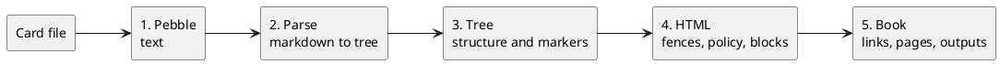

# How a Card Is Processed

A card goes through two kinds of processing, and they don't overlap. First Pebble writes
the card's text: it fills in `{{ vars.x }}`, runs `` and ``, and splices
in fragments and snippets. Then paperband reads the structure of that text: which heading
owns which paragraphs, which block a `{.class}` belongs to, what number a `{!step}` gets.

One rule follows from that order, and the rest of this card is detail:

**Pebble writes the text; paperband reads its structure.**

Pebble runs before there is any structure to see, so it can create headings and sections
but can't ask about them. Paperband's markers run after the structure exists, so they can
depend on it but can't generate more text for Pebble to process.

## The phases



| Phase | Reads | Produces | Owns | Can't see |
|---|---|---|---|---|
| 1. Pebble | The card file as text, with its frontmatter, fences and inline code hidden; the `vars` cascade; `layouts/` snippets; fragment sources | Markdown text | `{{ }}`, ``, `{# #}` | Headings, sections, numbers, anchors, the card's own frontmatter |
| 2. Parse | The body, after the frontmatter is split off | A markdown tree | Markdown itself; anything in code becomes code and is never read again | Other cards |
| 3. Tree | That tree | The same tree with sections, attributes, spans and numbered steps | `{!name}`, `{.x}`, `{/x}`, `{key=value}` | Other cards |
| 4. HTML | The card rendered to HTML | The card's blocks: heading, classes, attributes, directives, and their content as HTML and as nodes | ` ```type ` fences a renderer module draws, the `ast:` fallback, the content policy | Other cards |
| 5. Book | Every card's blocks, in book order | The PDF, the site and any other outputs | `card:` links, `:icon:` references, chapter numbers, the table of contents and index, block templates for ` ```type ` fences, layout templates, which can reorder blocks into slots, pick parts out of them with `select` and read them as data with `find` | Nothing is hidden: this is the first phase with the whole book |

An `.html` card skips phases 2 and 3, because it has no markdown to parse; its blocks come
from its headings in phase 4. A `.yaml` card is turned into markdown first and then goes
the same way as any other.

### Phase 3, step by step

The tree phase is five passes, and the order matters because each one sees what the one
before it left:

1. **Directives** finds `{!name}` markers in the text and checks each name. A bare word in
   braces, such as `{step}`, fails here.
2. **AttributeSyntax** takes the groups whose position gives them a target: a fence's info
   line, a group touching a link or code span, one at the end of a block, one on its own
   line.
3. **Spans** turns every group still in the text into a span, closed by `{/x}` or the end
   of the element.
4. **Sections** wraps each heading and what it owns in a section, which is where a
   heading's classes and directives end up, and checks that raw HTML is self-contained.
5. **Steps** numbers each parent's stepped children and writes "Step N" into each
   `{!step}`.

## What the rule means in practice

**A loop can make structure.** Pebble's output is just text, and the tree phase reads
whatever text it gets. So a loop that writes headings produces real sections, and steps in
it are numbered like any others:

```markdown

## {!step} {{ s.title }}

{{ s.body }}

```

**A template can't print a number that doesn't exist yet.** A step's number is worked out
in phase 3, after Pebble has finished, so no Pebble expression can read it. Show it with
`{!step}` in the text, with CSS on `data-paperband-step`, or from a layout template in
phase 5, which sees it as `block.directives.step`.

**A value becomes source.** Pebble substitutes before markdown is parsed, so a var whose
value is `**bold** {.x}` is markdown by the time phase 2 sees it. That's useful, and it's
also why a value containing a stray `{step}` fails the build like one typed in the card.

**Each brace form has one owner.** No two phases read the same spelling:

| Written | Read by | In phase |
|---|---|---|
| `{{ … }}`, ``, `{# … #}` | Pebble | 1 |
| `{!step}` | Directives, then Steps | 3 |
| `{.x}`, `{key=value}`, `{id=x}` | AttributeSyntax, or Spans when mid-text | 3 |
| `{/x}` | Spans | 3 |
| `{a, b}`, `{ x }`, `${home}` | nobody: printed as written | — |

## Which phase do I need?

| If you need to… | Use | Phase |
|---|---|---|
| Show a value from `paperband.yaml` | `{{ vars.x }}` | 1 |
| Include or leave out a passage | `` | 1 |
| Repeat a passage for each item of a list | `` | 1 |
| Embed a file or part of one | `` | 1 |
| Reuse a Pebble snippet or macro | ``, `` | 1 |
| Class a block or its section | `{.x}` at the end of a heading or paragraph | 3 |
| Class part of a sentence | `{.x}` … `{/x}` in the text | 3 |
| Number steps | `{!step}` | 3 |
| Compute a fence's HTML, such as drawing a diagram | a ` ```type ` fence a renderer module claims | 4 |
| Change how a fence type is written | a block template, `layouts/blocks/<type>.html` | 5 |
| Link to another card | `[text](card:id)` | 5 |
| Change how every card looks | a theme, or a template in `layouts/` | 5 |
| Move a block to another place on the page | a slot, `card.slots.take('name')`, in `_card-body.html` | 5 |
| Make a cheat sheet of each card's steps | `<view>cheatsheet</view>` in a second execution, see [Make a Cheat Sheet](card:make-a-cheat-sheet) | 5 |
| Change what a build writes and which cards it holds | a view: a folder of templates with a `keep.html`, see [Themes](card:themes#views) | 5 |
| Build some other document from parts of the cards | a separate `_card-body.html` using `block.html \| select('css')` | 5 |
| Fill a fragment of your own from a card's content | `block.nodes \| find('css')`, see [Themes](card:themes#reading-a-block-as-data) | 5 |

If something needs to know the structure (a number, a parent, a neighbour), it belongs in
phase 3 or later, not in Pebble.

Slots and `select` find blocks and elements by the ids and classes phase 3 gave them. A
heading's explicit class replaces its slug, so `## Watch Out {.warning}` is `warning` to
a slot, not `watch-out`; a mid-text span isn't a block and can't be taken; and a nested
block always travels with its parent. See
[Themes](card:themes#structural-templates-block-slots).

## Two Pebble passes

Pebble appears twice, and the two don't share anything. In phase 1 it runs over each
card's own text, sees only `vars`, and produces markdown. In phase 5 it runs the layout
templates (a theme's, or the book's own under `layouts/`) over the finished book, where
each card is already HTML and its blocks, frontmatter and directives are data:
`card.frontmatter.oneliner`, `block.directives.step`. A card's text is never evaluated
again in phase 5, so a `{{ }}` that survived phase 1 in a code block stays exactly as
written.

## Watch Out

`{#` starts a Pebble comment, and Pebble reads the card before anything else does. That's
why an element id is written `{id=x}`, not Pandoc's `{#x}`. To print any of Pebble's
spellings literally, put them in inline code or a fence, which phase 1 never evaluates.
